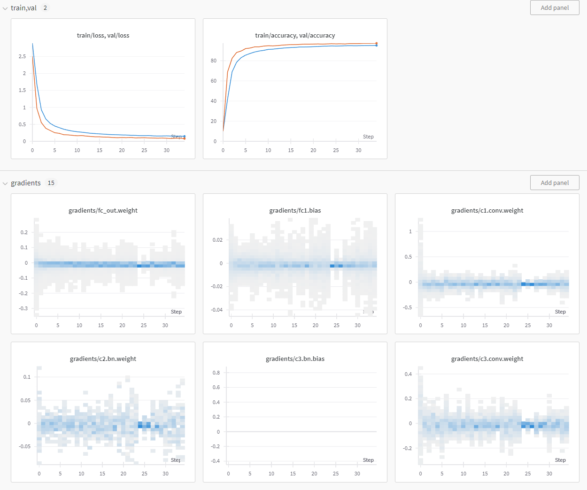

# Handwritten Digit Recognition

The goal of this project is to build a model that performs handwritten digit recognition using the MNIST dataset and use W&B for experiment tracking and model registry. Model will be used to implement a simple web app that allows users to draw a digit and get a prediction from it. Model has been developed using PyTorch.

